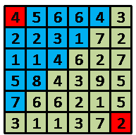

# 深度优先搜索

## 特点
走投无路再回溯，包含所有可能情况

## 求数字n的全排列 [洛谷P1706 全排列问题](https://www.luogu.com.cn/problem/P1706#submit)
用数组vis记录当前序列是否包含第i个数，当step = n+1 时序列已经装载完成，输出。
关键是回溯vis[i] = false;回溯可以返回上一层的状态继续遍历不同的情况
```c++
#include <bits/stdc++.h>
using namespace std;
bool vis[10];
int num[10];
void dfs(int step);
int n = 0;
int main()
{
    ios::sync_with_stdio(false);
    cin.tie(NULL);
    cout.tie(NULL);
    memset(vis, 0, sizeof(vis));
    cin >> n;
    dfs(1);
    return 0;
}
void dfs(int step)
{
    if (step == n + 1)
    {
        for (int i = 1; i <= n; i++)
        {
            cout << "    " << num[i];
        }
        cout << endl;
    }
    else
    {
        for (int i = 1; i <= n; i++)
        {
            if (!vis[i])
            {
                vis[i] = true;
                num[step] = i;
                dfs(step + 1);
                vis[i] = false;
            }
        }
    }
}
```

## 骨头的诱惑 [杭电OJ 1010](https://acm.hdu.edu.cn/showproblem.php?pid=1010)

>**题目描述**
>一只小狗在一个古老的迷宫里找到一根骨头，当它叼起骨头时，迷宫开始颤抖，它感觉到地面开始下沉。它才明白骨头是一个陷阱，它拼命地试着逃出迷宫。迷宫是>一个N×M 大小的长方形，迷宫有一个门。刚开始门是关着的，并且这个门会在第T秒钟开启，门只会开启很短的时间（少于一秒），因此小狗必须恰好在第T 秒达到>门的位置。每秒钟，它可以向上、下、左或右移动一步到相邻的方格中。但一旦它移动到相邻的方格，这个方格开始下沉，而且会在下一秒消失。所以，它不能在一>个方格中停留超过一秒，也不能回到经过的方格。小狗能成功逃离吗？请你帮助他。

>**输入描述：**
输入文件包括多个测试数据。每个测试数据的第一行为三个整数：N M T，（1<N, M<7；
0<T<50），分别代表迷宫的长和宽，以及迷宫的门会在第T 秒时刻开启。
接下来N 行信息给出了迷宫的格局，每行有M 个字符，这些字符可能为如下值之一：
X: 墙壁，小狗不能进入 S: 小狗所处的位置
D: 迷宫的门 . : 空的方格
输入数据以三个0 表示输入数据结束。
**输出描述：**
对每个测试数据，如果小狗能成功逃离，则输出"YES"，否则输出"NO"。
### 分析
- 题目要求恰好在t秒时到达D点，用DFS。如果是在t秒前到达D点，则用BFS更好。
- 对于方向的遍历可以用一个二维数组存储，再循环遍历比较方便。
>int dir[4][2] = {{-1, 0}, {1, 0}, {0, -1}, {0, 1}};
- 由于是在t时刻到达指定位置，可使用奇偶性剪枝优化
>(sx + sy + dx + dy) % 2 != t % 2

```c++
#include <bits/stdc++.h>
using namespace std;
int dir[4][2] = {{-1, 0}, {1, 0}, {0, -1}, {0, 1}};
char Map[10][10];
int dx, dy, t, n, m;
bool escape;
void dfs(int x, int y, int cnt);
int main()
{
    ios::sync_with_stdio(false);
    cin.tie(NULL);
    cout.tie(NULL);
    int sx, sy;
    while (cin >> n >> m >> t)
    {
        escape = false;
        int wall = 0;
        if (n == 0 && m == 0 && t == 0)
        {
            break;
        }
        for (int i = 1; i <= n; i++)
        {
            for (int j = 1; j <= m; j++)
            {
                cin >> Map[i][j];
                if (Map[i][j] == 'X')
                {
                    wall++;
                }
                else if (Map[i][j] == 'S')
                {
                    sx = i;
                    sy = j;
                }
                else if (Map[i][j] == 'D')
                {
                    dx = i;
                    dy = j;
                }
            }
        }
        if (n * m - wall <= t || (sx + sy + dx + dy) % 2 != t % 2)
        {
            cout << "NO";
            continue;
        }
        Map[sx][sy] = 'X';//注意标记起点！否则会出错！！！
        dfs(sx, sy, 0);
        if (escape)
            cout << "YES";
        else
            cout << "NO";
        cout << endl;
    }
    return 0;
}
void dfs(int x, int y, int cnt)
{
    if (x == dx && y == dy && cnt == t)
        escape = true;
    if (escape)
        return;
    if ( abs(x - dx) - abs(y - dy) > t-cnt)
        return;
    for (int i = 0; i <= 3; i++)
    {
        int x1 = x + dir[i][0];
        int y1 = y + dir[i][1];
        if (x1 >= 1 && x1 <= n && y1 >= 1 && y1 <= m && Map[x1][y1] != 'X')
        {
            Map[x1][y1] = 'X';
            dfs(x1, y1, cnt + 1);
            Map[x1][y1] = '.';
        }
    }
}
```

## 记忆化DFS
用数组存储已经求解的子问题的解，下次访问时可直接取得结果，可极大减少递归次数
### 记忆化Fibonacci
```c++
int dfs(int n)
{
    if(fib[n])
        return fib[n];
    if(n==1 || n==2)
        fib[n] = 1;
    else
        fib[n] = (dfs(n-1)+dfs(n-2))%1000000007;
    return fib[n];
}
```

### 0-1背包DFS
```c++
int dfs(int i,int v)
{
    if(i == 0 || v <= 0)
        return 0;
    if(dp[i][v])
        return dp[i][v];
    if(w[i] > v)
        dp[i][v] = dfs(i-1,v);
    else
        dp[i][v] = max(dfs(i-1,v),dfs(i-1,v-w[i])+value[i]);
    return dp[i][v];
}
```
### [FatMouse and Cheese](https://acm.hdu.edu.cn/showproblem.php?pid=1078)
>**问题描述**
胖老鼠在一个城市里储存了一些奶酪。城市可以被认为是一个维度为n的正方形网格：每个网格位置都被标记为（p，q），其中0<=p<n和0<=q<n。在每个网格位置，胖老鼠在一个洞里藏了0到100块奶酪。现在他将享受他最喜欢的食物。
胖老鼠开始站在位置（0,0）。他在站着的地方吃完奶酪，然后水平或垂直地跑到另一个地方。问题是，有一只名叫Top Killer的超级猫坐在他的洞附近，所以每次他都可以在被Top Killer抓住之前跑最多k个位置进入洞。更糟糕的是，在一个地方吃完奶酪后，胖老鼠变得更胖了。因此，为了获得足够的能量进行下一次跑步，他必须跑到一个比当前洞有更多奶酪块的地方。
给定n、k和每个网格位置的奶酪块数量，计算胖老鼠在无法移动之前可以吃的最大奶酪量。

>**输入**
有几个测试用例。每个测试用例包括包含1到100之间的两个整数的行：n和k。n行，每行有n个数字：第一行包含位置（0,0）（0,1）处的奶酪块数量...（0，n-1）；下一行包含位置（1,0）、（1,1）、…处的奶酪块的数量...（1，n-1），依此类推。
输入以一对-1结束。

>**输出**
对于一行中的每个测试用例输出，单个整数表示收集的奶酪块的数量。
#### 分析
有些问题可以用DP,但用DFS更容易表示。用一个数组Sum[x][y]记录从(x,y)处开始所能取得的最大奶酪数。以(x,y)开始向横纵遍历k个单位，找到最大奶酪数并记录。由于条件**每次吃的奶酪数是递增的**，所有递归遍历不会一直进行下去。如果已知(x,y)和其横纵的最大奶酪数量，则可以求得此处最大奶酪数为Map[x][y] + max。这样就把问题分解为子问题求其横纵的最大奶酪数量
#### 源代码
```c++
#include <bits/stdc++.h>
using namespace std;
int n, k;
int Map[110][110];
int Sum[110][110];
int dir[4][2] = {{1, 0}, {-1, 0}, {0, 1}, {0, -1}};
int dfs(int x,int y)
{
    if(Sum[x][y])
        return Sum[x][y];
    int ans = 0;
    for (int i = 0; i <= 3; i++)
    {
        for (int j = 1; j <= k; j++)
        {
            int nx = x + dir[i][0] * j;
            int ny = y + dir[i][1] * j;
            if(nx >=1 && nx <=n && ny >= 1 && ny <=n && Map[nx][ny]>Map[x][y])
            {
                ans = max(ans, dfs(nx,ny));
            }
        }
    }
    Sum[x][y] = ans + Map[x][y];
    return Sum[x][y];
}
int main()
{
    ios::sync_with_stdio(false); cin.tie(NULL); cout.tie(NULL);
    while (cin>>n>>k)
    {
        if(n == -1 && k == -1)
        {
            break;
        }
        for (int i = 1; i <= n; i++)
        {
            for (int j = 1; j <= n; j++)
            {
                cin >> Map[i][j];
            }
        }
        memset(Sum, 0, sizeof(Sum));
        cout << dfs(1, 1);
    }
    return 0;
}
```
### [How Many Ways](https://acm.hdu.edu.cn/showproblem.php?pid=1978)
>**问题描述**
这是一个简单的生存游戏，你控制一个机器人从一个棋盘的起始点(1,1)走到棋盘的终点(n,m)。游戏的规则描述如下：
1.机器人一开始在棋盘的起始点并有起始点所标有的能量。
2.机器人只能向右或者向下走，并且每走一步消耗一单位能量。
3.机器人不能在原地停留。
4.当机器人选择了一条可行路径后，当他走到这条路径的终点时，他将只有终点所标记的能量。

>如上图，机器人一开始在(1,1)点，并拥有4单位能量，蓝色方块表示他所能到达的点，如果他在这次路径选择中选择的终点是(2,4)
点，当他到达(2,4)点时将拥有1单位的能量，并开始下一次路径选择，直到到达(6,6)点。
我们的问题是机器人有多少种方式从起点走到终点。这可能是一个很大的数，输出的结果对10000取模。

>**输入**
第一行输入一个整数T,表示数据的组数。对于每一组数据第一行输入两个整数n,m(1 <= n,m <= 100)。表示棋盘的大小。接下来输入n行,每行m个整数e(0 <= e < 20)。

>**输出**
对于每一组数据输出方式总数对10000取模的结果.
#### 分析
可以把问题分解成子问题，从左上角到右下角可以看作是第一次从左上角到达的所有位置再到达右下角的若干个子问题的和。然后对于每个子问题又可以调用dfs()进行求解。用一个二维数组way[x][y]记录从(x,y)点到达右下角的方案数。**注意!** way[n][m]开始是要初始化为1，否则为零的话所有结果为零。
#### 源代码
```c++
#include <bits/stdc++.h>
using namespace std;
int Map[110][110];
ll way[110][110];
int n, m;
ll dfs(int x, int y)
{
    if(way[x][y])
        return way[x][y];
    ll ans = 0;
    for (int i = x; i <= x + Map[x][y]; i++)
    {
        for (int j = y; j <= y + Map[x][y] - (i-x); j++)
        {
            if(i == x && j == y)
                continue;
            if(i >= 1 && i <= n && j >=1 && j <= m)
            {
                ans += dfs(i, j);
            }
        }
    }
    way[x][y] = ans%10000;
    return way[x][y];
}
int main()
{
    ios::sync_with_stdio(false); cin.tie(NULL); cout.tie(NULL);
    int t;
    cin >> t;
    while(t--)
    {
        cin >> n >> m;
        for (int i = 1; i <= n; i++)
        {
            for (int j = 1; j <= m; j++)
            {
                cin >> Map[i][j];
            }
        }
        memset(way, 0, sizeof(way));
        way[n][m] = 1;
        cout << dfs(1, 1)%10000;
    }
    return 0;
}
```